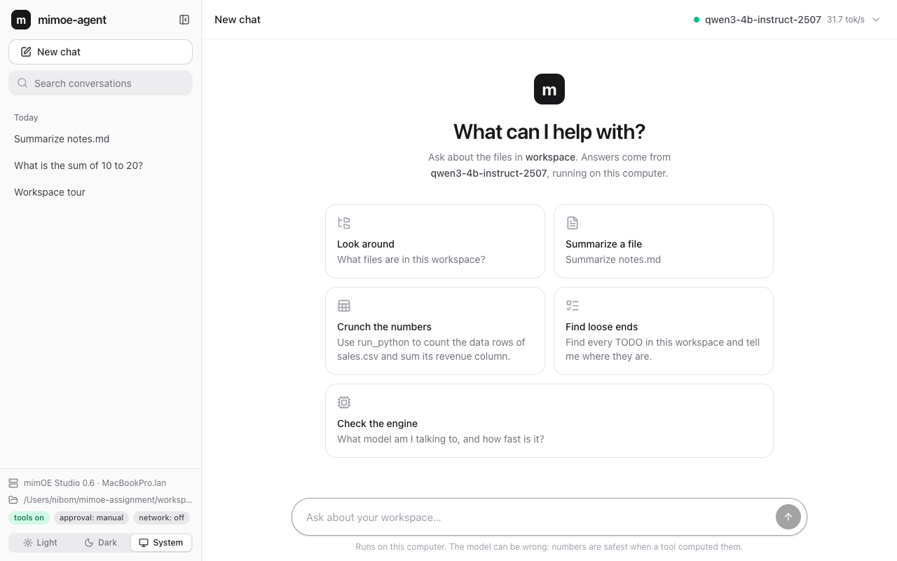
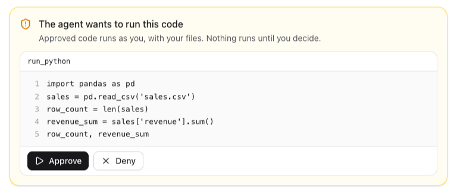
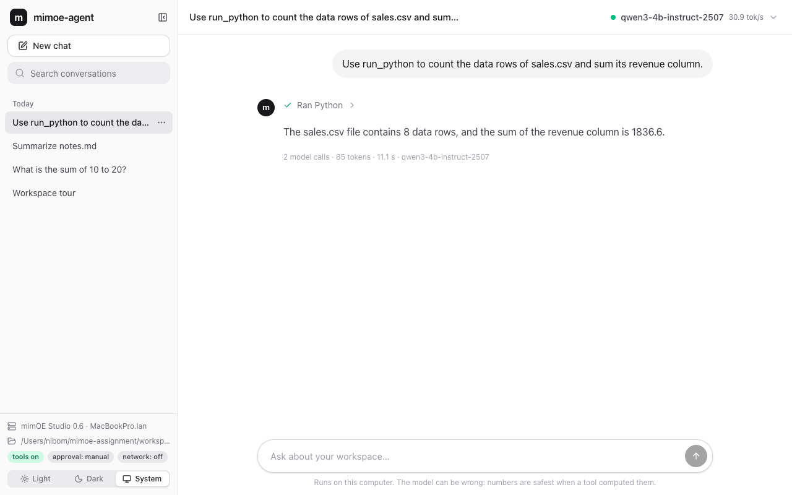
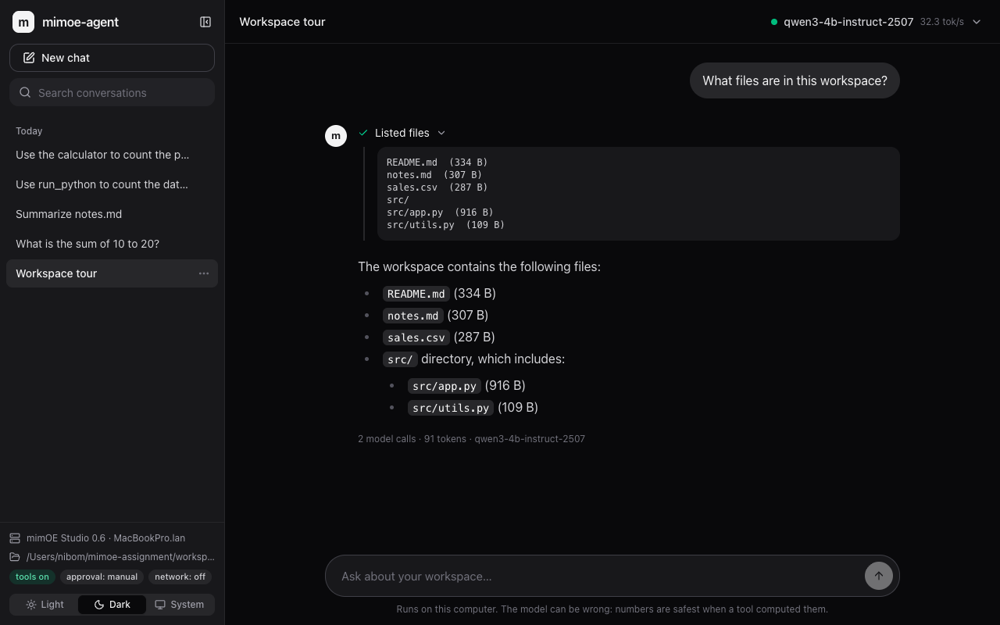
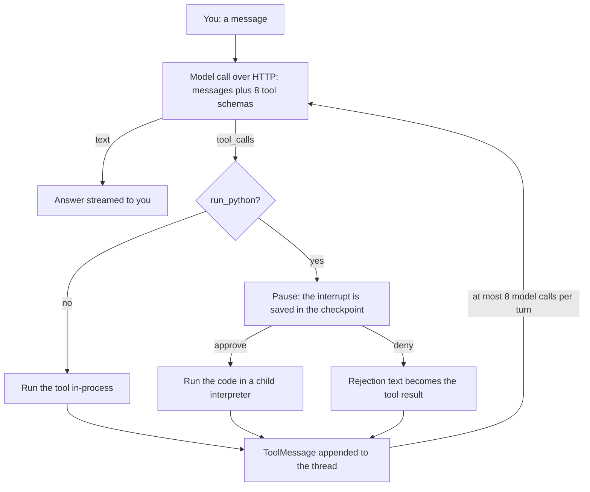
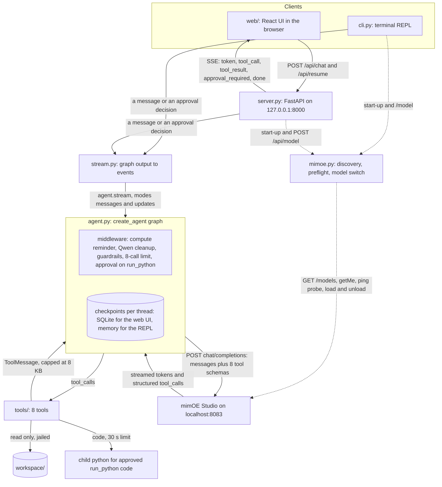
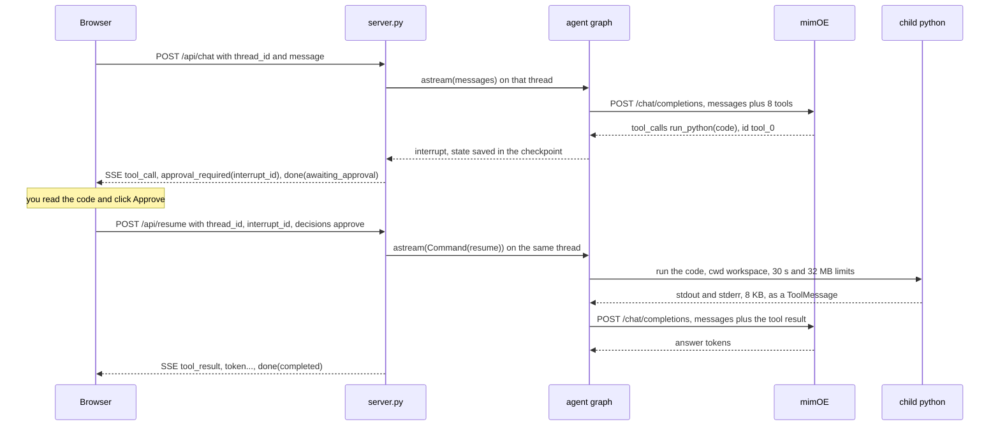

# mimoe-agent

A private, fully local dev/data assistant: a LangChain agent that runs on the mimOE Studio
on-device inference endpoint. Nothing leaves your machine.

This is my submission for the mimik "BYO Framework" assignment. I connected LangChain's
`create_agent` to the OpenAI-compatible endpoint that mimOE Studio exposes on `localhost:8083`,
gave the model eight tools over a sample workspace folder, and put a human approval step in front
of the one tool that can change anything (running model-written Python). It has a terminal REPL and
a small web UI, it works on both generations of Studio I could get hold of (0.6.5 and 1.0.27), and
the model choice is backed by a measured compatibility table rather than a guess.

CI: ruff + pytest on Ubuntu and Windows + vitest, green. Repository:
https://github.com/dalisyron/mimoe-langchain-agent

The assignment asks me to explain my approach, my framework and tooling choices, and how the
components connect. Those are the sections [Approach](#approach),
[Framework and tooling choices](#framework-and-tooling-choices) and
[How the components connect](#how-the-components-connect).

## What it does

You ask questions about a folder ("what files are here", "sum the revenue column", "where are the
TODOs") and a local model answers them by calling tools: list, read and search files, run Python,
a calculator, the clock, read-only git, and a status tool that reports on the engine itself. The
only tool that can change anything, `run_python` (also how the agent creates or edits files), stops
the run and asks you to approve or deny the code, in the terminal and in the browser, before anything
executes. Everything is on-device: the
model runs in mimOE Studio (the agent never picks a cloud or provider model that Studio may also
list), the agent's own tools never open a network connection, and the web server only listens on
`127.0.0.1`. The web UI keeps your conversations on this computer and lists them in a sidebar,
like ChatGPT's or Claude's, where you can search, rename and delete them; a reload or a server
restart reopens them, a pending approval included.









## Quickstart

About 5 minutes, plus a 2.5 GB model download.

1. **Install mimOE Studio and start its engine.** Use the download link from the assignment email.
   Studio 1.0.x asks on first launch to install the runtime and how it should run: choose
   **External** (a shared daemon on `localhost:8083`). **Built-in** opens no port, so no other
   program, this agent included, can reach it. The **API** button in Studio's model view shows the
   endpoint (`http://localhost:8083/mimik-ai/openai/v1`) and the key (`1234`); those are the
   agent's defaults.
2. **Install uv** (it installs Python 3.13 for you on first use), then open a new terminal so `uv`
   is on your PATH:
   ```bash
   curl -LsSf https://astral.sh/uv/install.sh | sh        # macOS, Linux
   powershell -ExecutionPolicy ByPass -c "irm https://astral.sh/uv/install.ps1 | iex"   # Windows
   ```
3. **Get the code.** On GitHub use Code > Download ZIP and unzip it (no git needed), or
   `git clone https://github.com/dalisyron/mimoe-langchain-agent.git`. `cd` into the folder.
4. **Get the recommended model**, `qwen3-4b-instruct-2507` (Qwen3-4B-Instruct-2507, Q4_K_M, 2.5 GB
   from `unsloth/Qwen3-4B-Instruct-2507-GGUF`). It scored 6/6 on tool selection on both engine
   generations, see [Model compatibility](#model-compatibility). The agent downloads it through
   Studio's own model registry, on either Studio generation:
   ```bash
   uv run mimoe-agent models pull qwen3-4b-instruct-2507
   uv run mimoe-agent models use qwen3-4b-instruct-2507
   ```
   The first `uv run` installs the locked dependencies (about 160 MB, 70 MB of it pandas and
   NumPy). Downloading and loading the model from Studio's own model page works just as well. The
   SmolLM2 model the email mentions also works, but only for plain chat: it cannot produce tool
   calls, so the agent starts in chat-only mode and says so in its banner.
5. **Terminal REPL:**
   ```bash
   uv run mimoe-agent
   ```
   The agent finds the engine, picks the loaded model and checks that it can call tools: Studio
   1.0 says so in its model list; on Studio 0.6 the agent runs one warm-up completion with a tiny
   `ping` tool, which also validates the API key and absorbs the cold start. Then it prints a
   banner with the model, tokens/s, the workspace and the five demo prompts. `/quit` exits.
6. **Web UI:**
   ```bash
   uv run mimoe-agent serve
   ```
   then open http://127.0.0.1:8000. Same agent, same approval flow, plus a model picker. The built
   UI is committed, so no Node.js is needed.

What to expect: on an Apple M1 Pro (16 GB) with Studio 0.6.5, `qwen3-4b-instruct-2507` decodes at
about 40 tokens/s and takes about 2.7 s to the first token on the full 8-tool prompt (36 tokens/s
on Studio 1.0.27); the first demo turn is about 10 s end to end from cold (two model calls). On a
CPU-only Windows Server 2025 VM (6 vCPU, Studio 1.0.27) the same model decodes at about 6
tokens/s. There the first prompt takes about a minute, because the engine reads the roughly
1,200-token system and tool prompt once (at about 25 tokens/s) and then caches it; after that each
demo prompt takes 25 to 30 s.

Tested on:

- macOS 26.6 on an Apple M1 Pro (16 GB) with Studio 0.6.5 and a Studio 1.0.27 runtime: the offline
  suite, the live smoke tests, the demo prompts in the terminal and the browser, and a real Ctrl-C
  under a terminal (the turn ends within 0.2 s).
- Windows Server 2025 (x64, CPU-only VM) with the Studio 1.0.27 runtime, installed from a ZIP of
  this repository: the offline suite (all pass; 7 POSIX-only tests skip), the five demo prompts,
  approve and deny, the web UI and API, a UTF-16 `.env`, and the Stop, memory and timeout kills
  (no `python.exe` left behind).
- Ubuntu through CI (offline tests only).

If something fails at start-up the message ends with a Studio click path ("no model is loaded:
Studio > Models > Load a chat model", "mimOE rejected the API key: Studio shows it under the API
button", and so on) and the process exits with 1. `--base-url http://localhost:PORT/mimik-ai/openai/v1`
if your Studio listens elsewhere. If you would rather not use uv, the project is a normal
`pyproject.toml` (hatchling), so a Python 3.13 venv with `pip install -e .` should give you the
same `mimoe-agent` command; I have only tested the uv path. On Windows, if Studio's runtime does
not start and reports a missing `VCRUNTIME140.dll`, install the Microsoft Visual C++ 2015-2022 x64
redistributable (most machines already have it).

## Try it

Type these in order (the CLI banner lists them; they live in `workspace/README.md`). The answers
below are quoted from real sessions in `docs/transcripts/` (qwen3-4b on Studio 0.6.5); your
wording will differ, the facts should not.

| # | Prompt | Tool the model picks | You should see something like |
|---|---|---|---|
| 1 | `What files are in this workspace?` | `list_files` | "The files in the workspace are: README.md, notes.md, sales.csv, src/app.py, src/utils.py", each with its size. Five files, matching `ls -R workspace`. |
| 2 | `Summarize notes.md` | `read_file` | A short list: the CSV export shipped in week 38, a regression test is needed before the next release, the customer call went well and they want the dashboard by October, two ideas about caching the report and nightly versus on-demand runs. |
| 3 | `Use run_python to count the data rows of sales.csv and sum its revenue column.` | `run_python`, after your approval | The pandas code with line numbers, then `Run this code? [y/N]`. After `y`: "The sales.csv file has 8 data rows, and the sum of the revenue column is 1836.6." Check: `sales.csv` has 8 data rows below the header and the revenue column sums to 1836.6. After `n`: "The code was not executed as the user declined to run it." and the model stops. |
| 4 | `Find every TODO in this workspace and tell me where they are.` | `search_files` | "notes.md (line 5): TODO: add a regression test ...; notes.md (line 10): TODO: decide whether the report runs nightly or on demand" (plus README.md line 8, which is this prompt). The workspace has a third TODO in `src/app.py` line 25; in my runs the model searched `*.md` only and missed it, so if yours does too, ask it to search `*.py` as well. |
| 5 | `What model am I talking to, and how fast is it?` | `mimoe_status` | "You are talking to the "qwen3-4b" model, which has 4.0B parameters. It processes 31.8 tokens per second on average." Your model id and number will differ; they come from `GET /models`. |

Why prompt 3 says "Use run_python": with the plain question ("How many rows does sales.csv have,
and what is the total revenue?") qwen3-4b on a fresh session sometimes read the CSV with
`read_file` and counted the header as a row (9 rows). The explicit wording produced a `run_python`
call in every recorded run (CLI transcript 02, the browser session). It is also the prompt that
shows the approval flow, which is the point of the demo.

REPL commands: `/new` (fresh conversation), `/status`, `/verbose` (full tool results, and the
error of a failed call, which otherwise shows as one "failed, trying a different approach" line), `/model ID`
(switch model), `/models`, `/help`, `/quit`. Ctrl-C during a turn cancels it at once (the answer
stops and a running snippet is killed) and keeps the session. `--think` turns the model's reasoning
on and shows it collapsed.

The transcripts: `01-demo-prompts.md` (the five prompts with the approval), `02-denied-run-python.md`,
`03-model-switch.md`, `04-piped-stdin.md`, `05-models-list.md`, `06-ctrl-c-mid-turn.md`,
`07-bad-base-url.md`, `08-models-use-unload.md`, and `web-session.md` (the browser run with every
SSE frame the page received).

## Approach

In plain English, one turn works like this:

1. Your message and the schemas of the eight tools go to the model in one `POST /chat/completions`
   to mimOE, with streaming on.
2. The model either answers in text or asks for a tool; mimOE turns the model's `<tool_call>` text
   into a structured `tool_calls` entry, so the agent sees a normal OpenAI-style function call.
3. The agent runs the tool in-process, except `run_python`, which first pauses the run and asks you
   to approve or deny the code it wants to execute.
4. The tool's result goes back to the model as a `tool` message and the loop repeats, at most
   8 model calls per turn.
5. Everything that happens (tokens, tool calls, tool results, the approval request, the final
   stats) is emitted as an event while it happens, and the terminal and the browser render the
   same event stream.

Before the first turn, a preflight discovers the engine (`GET /models`, JSON-RPC `getMe`), picks
the model, decides how to switch thinking off for that engine generation, and runs the warm-up
`ping` completion. A model that does not answer the ping with a structured tool call gets the agent
in chat-only mode (`--force-tools` overrides), so a reviewer who only loaded SmolLM2 still gets a
working, honest program.



Two lines of LangGraph vocabulary, since `create_agent` compiles to a LangGraph graph:

- **Thread** and **checkpoint**: a thread is one conversation, identified by a `thread_id`; after
  every step the graph saves its state (the messages so far and any pending interrupt) as a
  checkpoint, so a run can stop and continue later. The web server keeps checkpoints in SQLite
  (`AsyncSqliteSaver`), so conversations survive a restart; the REPL keeps them in memory.
- **Interrupt** and **resume**: `HumanInTheLoopMiddleware` raises an interrupt when the model calls
  `run_python`; the run ends with the state saved and the request reported to you; a later
  `Command(resume={"decisions": [...]})` on the same thread continues the graph from exactly that
  point, running or rejecting the call. In the web UI those are two separate HTTP requests.

## Framework and tooling choices

| Choice | Why | The alternative I rejected, and why |
|---|---|---|
| LangChain `create_agent` (LangChain 1.4 on LangGraph 1.2) | The loop, tool schemas, message bookkeeping, threads and the interrupt/resume mechanism are built in and tested; my code is the prompt, the tools, two small middleware classes and the wiring. | A raw OpenAI-SDK loop: about the same size for the happy path, but the approval pause across HTTP requests, per-thread state and tool error handling would all be hand-written and untested. "Simplest path" to me means the fewest things I have to get right myself. |
| `ChatOpenAI` from langchain-openai, plus a handful of mimOE adjustments: chat completions pinned (`use_responses_api=False`), the token cap sent as `max_tokens` in `extra_body` (ChatOpenAI renames it to `max_completion_tokens`, which mimOE ignores), `timeout=200` and `max_retries=0` (above the engine's 180 s limit; never replay a timed-out inference), `httpx` clients with `trust_env=False` (a proxy variable must not capture localhost), and a small subclass that keeps the `reasoning_content` field 1.0 engines send. | The endpoint is OpenAI-compatible except for exactly these quirks, and each one is a one-line fix in the constructor. | A custom `httpx` client: I would have re-implemented streaming, tool-call delta assembly and the error classes, for no gain. |
| Built-in `HumanInTheLoopMiddleware` on `run_python` | The pause survives across requests through the checkpoint, behaves identically in the CLI and the web UI, and the library validates the decision shape. | A prompt-only rule ("ask before running code"): a 4B model forgets instructions, and a safety boundary has to live in code, not in the prompt. |
| FastAPI + Server-Sent Events (`sse-starlette`) | Two POSTs (`/api/chat`, `/api/resume`) that stream events; plain HTTP you can `curl -N`; nothing to keep alive between requests. | WebSockets: bidirectional, but nothing here needs the client to talk mid-stream, and an approval is naturally a second request. SSE is easier to test and debug. |
| React + Vite + TypeScript, styled with Tailwind CSS and shadcn/ui-style components (Radix for the menus, lucide icons), with the built bundle committed in `web/dist` | The reviewer needs no Node.js; the components are copied in rather than a UI framework, nothing loads from the internet (system fonts, no CDN), and the reducer, SSE parser, stream consumer, tool steps, sidebar grouping and Markdown safety have vitest tests. | Streamlit or Gradio: the per-turn tool steps, the approval panel with one decision per request, Stop and resume did not fit their request/rerun model. LangChain's agent-chat-ui: polished, but it talks only to a LangGraph Server, whose default accepts requests from any website (it could start a run and approve its own code), needs Node to run, and renders images from model output. |
| uv | One command installs Python 3.13 and the locked dependencies on macOS, Windows and Linux; `uv run mimoe-agent` is the whole quickstart. | pip or poetry: pip needs a Python 3.13 and a venv first; poetry is one more tool to install. |
| Plain `@tool` functions, with pandas available to `run_python` | Eight ordinary functions whose docstrings are the descriptions the model reads; pandas because the model reaches for it every time and gets CSVs right (my csv-module fallback miscounted the header row). | RAG, a vector store or SQLite: the workspace is small, `read_file`/`search_files`/`run_python` answer everything, and an index is more setup, more dependencies and one more thing that can be stale. |
| An in-process fake engine for tests (`httpx.MockTransport` injected into ChatOpenAI and the engine client) | It reproduces the quirks of both engine generations (inline `<think>`, `reasoning_content`, `tool_0` ids, the error bodies, the model store), so 742 tests run on CI without Studio; eight live tests sit behind `MIMOE_LIVE=1`. | Recorded cassettes (VCR-style): brittle against streaming chunk boundaries, awkward to script a tool call followed by an answer, and tied to one engine version. |
| Python 3.13 as the floor | The workspace jail uses `ntpath.isreserved` (new in 3.13) and `Path.is_junction` (3.12) for Windows; uv installs 3.13 anyway. | Supporting 3.10 to 3.12 with fallbacks: more code paths to test on Windows for no benefit to the reviewer. |

## How the components connect



What each module does, in reading order:

- `config.py`: settings from flags, `MIMOE_*` variables, `./.env` and defaults, with the source of
  every value (the banner prints it).
- `mimoe.py`: the engine client. Finds the base URL and the engine generation, lists loaded and
  registered models, loads and unloads on both API shapes, runs the warm-up `ping` probe, and turns
  every failure into a message plus a Studio click path (`friendly_error`).
- `llm.py`: the `ChatOpenAI` factory pinned for mimOE (see the choices table).
- `agent.py`: the system prompt and `build_agent`, which is one `create_agent(...)` call with five
  middleware in this order: `ComputeReminderMiddleware` (adds "(Use calculator or run_python for any
  arithmetic.)" after a question that contains a number, in the request only; a small model answered
  small sums from memory despite the system prompt's rule), `QwenMiddleware` (moves inline `<think>`
  text out of the answer, appends
  `/no_think` on 0.6 engines, neutralises a malformed tool call), `GuardrailMiddleware` (caps every
  tool result at 8 KB, turns a tool exception into an error message the model can read, marks a
  result that reports a failure, such as `ERROR: ...` or a snippet that exited non-zero, as failed
  so both interfaces can say so in one line while the model reads the error, shortens tool results
  from earlier turns to 400 characters in the request only, resets the per-turn budget),
  `ModelCallLimitMiddleware(thread_limit=8)`, and `HumanInTheLoopMiddleware` on `run_python`
  (omitted with `--auto-approve`).
- `stream.py`: drives `agent.stream(..., stream_mode=["messages", "updates"])` and maps what
  LangGraph yields to neutral event dicts. Both clients use it, so the CLI and the web UI cannot
  drift apart. It also splits thinking from answer text in both transports (inline tags on 0.6,
  `reasoning_content` on 1.0) and makes tool-call ids unique (mimOE numbers every reply from
  `tool_0`).
- `tools/`: `workspace.py` (the path jail and `list_files`, `read_file`, `search_files`),
  `run_python.py` with `_runner.py` (the child interpreter), `system.py` (`calculator`, `now`,
  `git`, `mimoe_status`).
- `models.py`: the six model presets with their measured notes, `pull` through the registry of
  either generation, and `switch_model`.
- `cli.py`: the REPL, `serve`, and the `models` subcommands. Each turn runs on a worker thread
  while the REPL thread renders its events, because LangGraph runs graph nodes on pool threads
  and Python delivers Ctrl-C only to the main thread; Ctrl-C sets the turn's cancel signal.
- `server.py`: the HTTP API below, one `asyncio.Lock` per thread, lazy start (the server comes up
  even when Studio is down and reports the hint in `/api/health`), and the static bundle.
- `history.py`: the conversation history. One SQLite file holds LangGraph's checkpoints and a small
  table of titles and times for the sidebar; `transcript()` turns a reopened thread's messages
  back into the turns the UI drew while they streamed (tool-call ids and a pending approval
  included, so a resume after a restart lands on the right call).
- `web/src`: `events.ts` (the wire types), `sse.ts` (parser), `api.ts`, `reducer.ts` (events to
  ordered blocks per assistant turn), `useChat.ts` and `useThreads.ts`, `threads.ts` (sidebar
  grouping), and the components (`Sidebar`, `TopBar`, `ModelMenu`, `Transcript`, `ToolCard`,
  `ApprovalPanel`, `Composer`).

The HTTP API and the events (the full contract is in `docs/CONTRACTS.md`):

| Route | Body | Result |
|---|---|---|
| `POST /api/chat` | `{thread_id, message}` | SSE stream; 409 while a run is in progress or an approval is pending on that thread |
| `POST /api/resume` | `{thread_id, interrupt_id, decisions: ["approve" or "reject", ...]}` | SSE stream; 409 if nothing is pending or the id is stale, 422 if the decisions do not fit |
| `GET /api/health` | | model, tokens/s, context, engine version and generation, workspace, mode `tools` or `chat_only`, and the error hint when Studio is not usable |
| `GET /api/models`, `POST /api/model` | `{model, unload_previous}` | list loaded and registered models; switch, re-probe and rebuild the agent |
| `GET /api/threads` | | the saved conversations, most recently used first: `{id, title, created_at, updated_at}` |
| `GET /api/threads/{id}` | | one conversation's turns as the UI draws them, and its pending approval, if any |
| `PATCH /api/threads/{id}`, `DELETE /api/threads/{id}` | `{title}` | rename; delete the conversation and its checkpoints (409 while it runs) |
| `GET /` | | the committed `web/dist` |

| Event | Payload | When |
|---|---|---|
| `token`, `thinking` | `{text}` | answer text, reasoning text (shown collapsed) |
| `tool_call` | `{id, name, args}` | the model asked for a tool |
| `tool_result` | `{id, name, content, is_error}` | the tool answered, or the rejection; `is_error` when it failed |
| `approval_required` | `{interrupt_id, action_requests, review_configs}` | `run_python` is waiting for you; followed by `done` |
| `notice` | `{text}` | the model-call limit ended the turn |
| `done` | `{status: completed or awaiting_approval, elapsed_s, model, usage_total}` | end of the run |
| `error` | `{message, hint}` | failure, no `done` follows |

One approved `run_python` in the web UI, across two HTTP requests:



What happens on Deny: the resume carries `{"type": "reject", "message": "The user declined to run
this code. Tell the user it was not executed and stop; do not retry."}`. The middleware writes that
sentence as an error `ToolMessage` in place of a result (no code runs), the model reads it and
answers along the lines of "The code was not executed as the user declined to run it", the CLI
prints "not executed; the model is told the code did not run", and the web card turns to `denied`.
A bare reject without the message produced a confused answer, hence the wording. In the CLI, EOF,
Ctrl-C at the question and anything other than `y`/`yes` count as a denial. The server validates a
resume before it touches the graph (right thread, right `interrupt_id`, one allowed decision per
request), because a malformed resume would poison the thread.

## Model compatibility

Measured on an Apple M1 Pro (16 GB), one model at a time, temperature 0; the same six tool prompts
plus a round trip (a tool result followed by a final answer) per model. Full numbers, request bodies
and error texts: [docs/compatibility.md](docs/compatibility.md) and `docs/compatibility.json`.

| Model (Q4_K_M unless noted) | Size | Studio 0.6.5 (llama.cpp from Nov 2025) | Studio 1.0.27 (llama.cpp from Aug 2026) | Verdict |
|---|---|---|---|---|
| `qwen3-4b-instruct-2507` | 2.5 GB | loads; tools 6/6; 39.7 tok/s; 2.7 s to first token | loads; 6/6; 36.1 tok/s; 3.2 s | **recommended default** |
| `qwen3-4b` | 2.5 GB | 6/6; 39.6 tok/s; 2.5 s | 6/6; 32.9 tok/s; 2.8 s | works; a thinking model, keep thinking off |
| `qwen3-8b` | 5.0 GB | 6/6; 23.5 tok/s; 4.3 s | 6/6 (speed not representative, the host was swapping) | works; about 40% slower per token, 5 GB |
| `smollm3-3b` | 1.9 GB | 1/6, tool calls come back as plain text | 5/6 structured, but the round trip fails | engine-dependent; not for tools |
| `smollm2-360m` (Q8_0) | 0.4 GB | cannot tool-call; 135 tok/s | cannot tool-call; 151 tok/s | chat-only fallback |
| `qwen3.5-4b` | 2.7 GB | does not load (HTTP 500) | 6/6 | 1.0.27 only |
| `qwen3.5-9b` | 5.7 GB | does not load | 6/6 | 1.0.27 only; needs 16 GB with nothing else open |

Why `qwen3-4b-instruct-2507` is the default: 6/6 with valid JSON arguments on both engines, a clean
round trip, the same size and speed as `qwen3-4b`, and no thinking mode to manage (no `<think>`
litter, no reasoning budget). With thinking on, Qwen3-4B spends its whole token budget reasoning
and never calls a tool on either engine, so thinking is off by default and `--think` is labelled
experimental. `qwen3-8b` is the opt-in for Apple Silicon machines with nothing else open.

Memory warning for 16 GB machines: during the matrix, another client loaded a second multi-GB model
on the other engine and the 0.6.5 engine aborted with a Metal out-of-memory error. Keep one model
loaded; the agent unloads the previous model when it switches unless you ask it not to, and warns
before loading a file over 4.5 GB.

Switching models:

```bash
uv run mimoe-agent models list                        # registry, loaded models, presets, the recommended default
uv run mimoe-agent models pull qwen3-8b               # a preset id, or owner/repo:QUANT from Hugging Face
uv run mimoe-agent models use qwen3-8b                # load it (unloads the previous one unless --keep-loaded)
uv run mimoe-agent models unload qwen3-8b
```

Inside the REPL, `/model qwen3-8b` does the same and re-runs the tool probe; the web UI has the
picker in the header. Studio 0.6.5 keeps one chat model in memory, so `--keep-loaded` is a request
the engine may not honour (the CLI tells you when that happened). I checked `models pull` end to end
on both Studio generations with a small model (a 145 MB GGUF, about 5 s each).

## About the mimOE endpoint

### Documented behaviour I relied on

Studio 0.6.5 ships its own API reference under
`mimOE Studio.app/Contents/Resources/skills/mim-dev/` (`reference-inference-api.md` and
`reference-model-registry.md`). The agent leans on these documented facts:

- The inference API is OpenAI-compatible at `http://localhost:8083/mimik-ai/openai/v1`, takes a
  Bearer token whose default is `1234`, supports `stream: true` (SSE with `data:` lines and
  `[DONE]`) and honours `max_tokens`.
- Tool calls: "mILM parses `<tool_call>` tags from model output and returns structured tool calls",
  so a `tools` array in the request comes back as OpenAI-style `tool_calls` with `finish_reason:
  "tool_calls"`. The request-body table does not list `tools`, but the chat template injects them
  and both engines answered structured calls in every probe.
- Errors from the model routes use `{"message": ..., "statusCode": ...}` rather than OpenAI's
  `{"error": {...}}`, which the doc itself warns about; `friendly_error` reads both shapes.
- `GET /models` lists the loaded models with `info` (`max_context`, `n_params`, `model_size`) and
  `metrics` (`tokens_per_second`, `avg_tokens_per_second`); the banner, `/api/health` and the
  `mimoe_status` tool show those numbers. `POST /models {"model"}` loads with an SSE progress
  stream, `DELETE /models?modelId=` unloads, and a model auto-loads on its first completion.
- The model registry at `http://localhost:8083/mimik-ai/store/v1` provisions in two steps
  (`POST /models` metadata, then `POST /models/{id}/download {"url"}` with SSE progress), which is
  what `models pull` does on a 0.6 engine.

### Found by probing

Each of these is one curl away. `B=http://localhost:8083/mimik-ai/openai/v1`,
`H='-H "Authorization: Bearer 1234" -H "content-type: application/json"'`. Re-run on Studio 0.6.5
with `qwen3-4b` loaded; the 1.0.27 points come from the compatibility matrix.

1. `/no_think` works on 0.6 but leaves an empty think block in front of every answer:
   `curl -s $B/chat/completions $H -d '{"model":"qwen3-4b","messages":[{"role":"user","content":"Say hello in three words. /no_think"}],"max_tokens":24}'`
   answers `"content": "<think>\n\n</think>\n\nHello there!"`. The agent strips it before the
   checkpoint and before the UI sees it.
2. `enable_thinking` is ignored on 0.6 and honoured on 1.0: the same call with
   `"enable_thinking": false` and no `/no_think` still answers `<think>\nOkay, so I need to figure
   out what 2 plus 2 is...` on 0.6.5, while 1.0.27 answers clean content and, when thinking is on,
   puts the reasoning in `reasoning_content`. The preflight picks the control per engine generation.
3. `max_completion_tokens` is ignored, `max_tokens` is honoured: with `"max_completion_tokens": 5`
   the model kept going (128 tokens, `finish_reason: "stop"`); with `"max_tokens": 5` it wrote 5
   and finished with `length`. langchain-openai renames `max_tokens` to `max_completion_tokens`, so
   the agent sends the cap through `extra_body`.
4. `response_format` is not enforced: with `"response_format": {"type": "json_schema", ...}` the
   answer was `Hello! How can I assist you today?`. So no structured output; tools instead.
5. Tool-call ids are `tool_0`, `tool_1`, ... on 0.6 (every reply numbers from zero again) and
   `call_0_xxxxxxxx` on 1.0.27:
   `curl -s $B/chat/completions $H -d '{"model":"qwen3-4b","messages":[{"role":"user","content":"Call the ping tool now. /no_think"}],"max_tokens":48,"tools":[{"type":"function","function":{"name":"ping","description":"Reply with pong.","parameters":{"type":"object","properties":{}}}}]}'`
   answers `"tool_calls": [{"id": "tool_0", "type": "function", "function": {"name": "ping", "arguments": "{}"}}]`.
   The web UI keys its tool cards by id, so `stream.py` aliases a repeat as `tool_0#2`.
6. `GET /models` answers 200 without any key on both generations (`curl -s $B/models`), while a
   completion without a key answers `401 {"error":{"code":401,"message":"Unauthorized"}}` and a
   wrong key `403 {"error":{"code":403,"message":"Forbidden"}}`, in the OpenAI shape rather than
   the documented one. That is why the preflight validates the key with the warm-up completion
   instead of trusting `GET /models`.
7. A wrong base path answers 503 with an empty body:
   `curl -s -o /dev/null -w '%{http_code}' http://localhost:8083/openai/v1/models` prints `503`;
   `friendly_error` turns that into "the base URL path is wrong".
8. Per-request execution limit: 180 s on 0.6.5 and 300 s on 1.0.27 (its log says "Serverless
   Timeout"). Hence `timeout=200` and `max_retries=0` in `llm.py`: the engine's error arrives
   before ours, and a timed-out inference is never replayed.
9. Past the 12k context the engine answers 500 with `llama_decode() failed` in the body (seen at
   about 23k prompt tokens); the agent maps it to "the conversation exceeded the model's context
   window, start a new one with /new". Tool results are capped at 8 KB and old ones trimmed so a
   normal session does not get there.
10. What 1.0.27 adds: `GET /models` entries carry `family`, `supported_parameters`
    (`["tools","tool_choice","parallel_tool_calls"]` for Qwen3, `null` for SmolLM2) and a
    `reasoning` block whose `can_disable` is `false` for every model even though
    `enable_thinking: false` works, so the agent trusts the generation, not the flag; `usage` adds
    `ttft_ms`, `decode_token_per_second` and `prompt_tokens_details.cached_tokens` (it reuses the
    prompt prefix: 805 of 821 tokens cached on the second tool prompt, which made tool turns
    0.6 to 1.2 s instead of 3 s); load and unload are `PUT {store}/models {"id", "action":
    "load"|"unload"}` while the 0.6-style `POST`/`DELETE /models` answer 404; a tool call streams
    as one complete delta where 0.6 sends the name first and the arguments in fragments.
11. Memory: two multi-GB models loaded across the two engines on a 16 GB Mac ended in Metal
    `kIOGPUCommandBufferCallbackErrorOutOfMemory` and a SIGABRT of the 0.6.5 engine process.
12. Studio 0.6.5 holds one chat model: loading another evicts the first, and once in a while it
    answered a load request with 201 without actually loading (the agent re-reads `GET /models`
    after every load and says so when the model is not there).
13. An error in the middle of a 0.6.5 stream (for example `llama_decode` failing when the context
    fills up) is written without the blank line that ends an SSE event, so a standard client just
    sees the stream stop and returns a cut-off answer. The agent treats a stream that ends without
    a `finish_reason` as an error with a context/memory hint.
14. `GET /models` can also list models mimOE does not run locally: a configured cloud model on 0.6
    (`owned_by: "cloud"`) and provider models on 1.0 (`owned_by: "provider:<id>"`, `attached`).
    The agent never picks those on its own and warns if you name one with `--model`.

## Safety, honestly

The agent's own tools never touch the network. Code you approve runs as you, with your files and,
with `--allow-network`, your network. The approval prompt is the only boundary. `--auto-approve`
means trust-the-model. File contents are untrusted input.

The web server saves every conversation, including the file contents and tool output the agent
saw, in a SQLite file only your user can read (created 0600 in a 0700 folder on macOS and Linux).
Deleting a conversation in the sidebar removes its checkpoints too; `serve --history off` keeps
nothing on disk. The REPL never writes a history.

What `run_python` does to keep accidents small (none of it is a sandbox):

- The code runs in a fresh interpreter (`python -X utf8 -u -P _runner.py`) with the workspace as
  its working directory, stdin closed, and an allow-listed environment (`PATH`, `HOME`, `TEMP` and
  friends; none of your other variables, so no secrets leak into it). The workspace goes on
  `sys.path` only after start-up, so a `sitecustomize.py` in it cannot run before the approved
  code, and `import mimoe_agent` is blocked in the child.
- Limits, checked ten times a second: 30 s wall clock, more than 2 GB of resident memory across
  the snippet and everything it spawned (measured with `psutil`, because macOS enforces no memory
  rlimit and a runaway snippet would otherwise push the machine into swap), or 32 MB of combined
  output, and the whole process tree is killed (a process group `SIGKILL` on POSIX, `taskkill /T`
  on Windows). Files it writes are capped at 64 MB on POSIX (`RLIMIT_FSIZE`); the model sees at
  most 8 KB of output.
- Ctrl-C in the CLI and Stop in the web UI end the turn at once: the turn's cancel signal kills a
  running snippet's tree and closes the model's stream.
- What escapes those limits: the memory check is a poll, so a very fast allocation can overshoot
  for a fraction of a second before the kill; a snippet that calls `setsid` leaves the process
  group and survives the kill on POSIX; on Windows a grandchild whose parent already exited
  survives `taskkill /T` (no Job Objects); the socket guard (unless `--allow-network`,
  `socket.socket` raises "network disabled for run_python") does not block DNS lookups and is
  bypassable through the `_socket` module. It stops accidental network use, nothing more.
- Before you approve, both clients print a red warning when the code mentions sockets, `urllib`,
  `requests`, `httpx`, `subprocess`, `os.system`, `shutil.rmtree`, `os.remove` or opening a file
  for writing, and another when it contains invisible or terminal-control characters (zero-width
  and bidirectional-override characters, ESC sequences). Those are shown escaped, so code cannot
  look different on screen from what runs. Read the code anyway.

The other tools:

- `list_files`, `read_file`, `search_files` are jailed to the workspace: `..`, absolute paths,
  drive letters and UNC paths outside it, symlinks and junctions that point outside, and reserved
  Windows names are refused (an absolute path inside the workspace, which the model copies from the
  system prompt, counts as the relative path it names); listing and searching skip `.git`, `node_modules`, `.venv` and similar; credential
  files (`.env`, `.env.*`, `*.pem`, `*.key`, `id_rsa*`, `credentials`, `.netrc`, `token.json` and
  similar, matched after Unicode normalisation and case folding) are refused, as are binaries and
  files over 2 MB. The jail is by path, so a workspace's `.git/config` is readable by `read_file`,
  and approved Python can of course read anything you can.
- `git` is read-only (`status`, `log`, `diff`) and runs without a shell, pager or prompt. It runs
  none of the repository's own code: hooks are pointed at the null device (`status` and `diff`
  rewrite the index, which fires `post-index-change`), filter drivers from the repository's config
  are disabled, and external diff, textconv and submodule recursion are off. Inherited `GIT_*`
  variables are dropped, so the tool always reports on the repository that contains the
  workspace; it times out after 20 s. The sample workspace lives in this repository, so `git log`
  shows my commits.
- Everything the model, a tool or the engine says is shown in the terminal with control
  sequences escaped: an ESC in a file or an answer could otherwise move the cursor, retitle the
  window or write your clipboard (OSC 52).
- `calculator` evaluates through an AST whitelist, no `eval`; expressions that would produce more
  than 100,000 digits are refused before they are computed.
- The web server binds `127.0.0.1` only, has no `--host` flag, accepts only `127.0.0.1`,
  `localhost` and `[::1]` as the `Host` header (a DNS-rebinding page in your browser cannot drive
  it), has no CORS and no authentication: it is a single-user tool. The UI renders model output as
  Markdown with raw HTML shown as text and `` dropped, because an image URL in an answer would
  beacon file contents to any server through your browser.
- LangSmith tracing variables are forced to `false` unless you pass `--trace`, so a
  `LANGSMITH_TRACING=true` in your shell does not upload prompts. All HTTP clients ignore proxy
  variables.

The most dangerous combination prints a warning in the banner: `--auto-approve` with
`--allow-network` means "model-written code runs unattended and may open network connections; file
contents are untrusted input". A file in the workspace that tells the model to post your data
somewhere then has a path to do it.

## Configuration

Precedence: command-line flags, then `MIMOE_*` variables in the process environment, then a
`.env` file in the current directory (only the four string settings are read from it, and it never
walks up to parent directories), then the defaults. The banner shows where every value came from.
Booleans accept `1/true/yes/on` and `0/false/no/off`; anything else is an error rather than a
silent `false`. `.env.example` lists the keys.

| Setting | Flag | Environment | From `.env` | Default |
|---|---|---|---|---|
| Base URL | `--base-url` | `MIMOE_BASE_URL` | yes | auto-discover: `http://127.0.0.1:8083/mimik-ai/openai/v1`, then `/openai/v1` on the same port, then `localhost` (IPv4 first: Windows spends about 2 s on every refused IPv6 connect); an explicit URL is never replaced by a candidate |
| API key | `--api-key` | `MIMOE_API_KEY` | yes | `1234`, validated by the warm-up completion |
| Model | `--model` | `MIMOE_MODEL` | yes | the first loaded chat model; the id must be loaded (`models use` loads it) |
| Workspace | `--workspace` | `MIMOE_WORKSPACE` | yes | `./workspace`; an error with a hint if it does not exist |
| Thinking | `--think` | `MIMOE_THINK` | no | off; on, the token cap rises from 1024 to 4096 and the reasoning is shown collapsed (`/verbose` for all of it); experimental |
| Auto-approve | `--auto-approve` | `MIMOE_AUTO_APPROVE` | no | off; on, `run_python` runs without asking |
| Network for approved code | `--allow-network` | `MIMOE_ALLOW_NETWORK` | no | off; lifts only the child's socket guard |
| Force tools | `--force-tools` | `MIMOE_FORCE_TOOLS` | no | off; skips the probe and offers the tools anyway |
| Tracing | `--trace` | `MIMOE_TRACE` | no | off; keeps LangSmith variables as they are |
| Web port | `serve --port` | | | 8000, loopback only |
| Conversation history | `serve --history PATH` (`off` keeps it in memory) | `MIMOE_HISTORY` | no | `conversations.sqlite` in the per-user data folder: `~/Library/Application Support/mimoe-agent/` on macOS, `%LOCALAPPDATA%\mimoe-agent\` on Windows, `~/.local/share/mimoe-agent/` on Linux |

Exit codes of the REPL: 0 after `/quit` or EOF, 1 for a configuration or preflight failure (the
hint is on stderr), 130 for Ctrl-C at the prompt. Piped input works
(`printf "What files are here?\n/quit\n" | uv run mimoe-agent --auto-approve`); without
`--auto-approve` an approval question reads its answer from the next stdin line.

## Development

```bash
uv sync                                   # dependencies plus the dev group
uv run pytest -q                          # 742 offline tests against the fake engine, no Studio needed
MIMOE_LIVE=1 uv run pytest -m live        # 8 live tests against a running Studio (a handful of completions)
uvx ruff check . && uvx ruff format --check .
cd web && npm ci && npm test && npm run build   # 41 vitest tests; the build writes web/dist
```

The committed bundle: `web/dist` is in git so that reviewers do not need Node.js. After a UI change
run `npm run build` and commit the new bundle in its own "build: refresh web bundle" commit; CI
rebuilds it and warns (without failing) when the committed one differs. For UI work without
inference, `uv run python web/dev/fake_backend.py` serves a scripted backend on `:8000` that plays
every event type, including the approval flow, and `npm run dev` proxies `/api` to it.

Tests: `tests/conftest.py` is an in-process fake of both engine generations behind
`httpx.MockTransport`, injected into ChatOpenAI's HTTP clients and the engine client, with a
scripted queue of replies and the model store. The suite covers the path jail, the `run_python`
kills and caps, the middleware, the stream mapping (sync and async), the agent's approve and reject
paths, the server's 409/422 and disconnect handling, scripted CLI sessions, and `models pull`/`use`
against the fake store. `tests/test_live.py` is the only file that talks to a real engine.

CI (`.github/workflows/ci.yml`): `lint` runs ruff on Ubuntu; `test` runs the offline suite plus a
`mimoe-agent --help` smoke on `ubuntu-latest` and `windows-latest` with Python 3.13 from
`uv sync --locked`; `web` runs `npm ci`, the vitest suite, the build and the bundle diff on Node 22.
Changes to only `README.md` or `docs/` do not trigger it.

## How I used AI coding assistants

I used Claude Code as the primary assistant, and I used it in an orchestrated way rather than as
an autocomplete. Before any code was written, research agents verified the LangChain 1.4 and
LangGraph 1.2 APIs against the installed source rather than the docs, probed the live endpoint on
both Studio generations and wrote down what they found; most of the "found by probing" list above
started there. Next it drafted a plan, which I revised with it and approved before any code was
written, and an interface contract (`docs/CONTRACTS.md`: signatures, data shapes, the SSE event
protocol); implementation agents then worked in parallel on disjoint files against that contract.
Each module then went to an adversarial reviewer whose job was to break it and add a regression
test for whatever it broke, and a final six-lens review of the whole repository found the last
round of defects. The model compatibility matrix was a separate,
measured job, and the CLI transcripts and the browser session are recordings of real runs, not
prose written by hand.

Things the assistant got wrong that tests or reviews caught:

| What it got wrong | How it was caught and fixed |
|---|---|
| A file search that hung forever on a FIFO in the workspace, and a search worker process that deadlocked on its own queue above 64 KB of hits | The reviewer's attack list. Regex search went away; files are type-checked on the open descriptor and read with a cap; both are regression tests now |
| Tool-call ids that collided across the model calls of one turn on the 0.6 engine (every reply is `tool_0`), so the web UI updated the wrong card after an approval | The server reviewer's resume test. Ids are aliased per conversation turn (`tool_0#2`) |
| A thinking-control rule keyed on the engine's `reasoning.can_disable` flag, which the matrix showed is `false` for every model on 1.0.27 although `enable_thinking: false` works | The compatibility matrix. The rule follows the engine generation instead |
| Two jobs using the two local engines at once: a live check auto-loaded a 2.5 GB model on one engine while the matrix had an 8B model loaded on the other | The 0.6.5 engine crashed with a Metal out-of-memory abort. The affected speed numbers are marked as not representative, the jobs got a one-model-at-a-time rule, and the agent unloads before it loads |
| Ctrl-C was meant to kill a running snippet, but LangGraph runs graph nodes on pool threads while it streams events, so the interrupt never reached the tool and the REPL froze until the step ended | The final review, reproduced with real SIGINTs under a pseudo-terminal. Each turn now runs on a worker thread with a cancel signal that kills the snippet and closes the model stream; tests interrupt the real REPL thread |
| The approval prompt printed model-written code with raw terminal escapes, so a snippet could erase a line and show something other than what runs | The final review, reproduced with a hidden line that ran after approval. Output is escaped and the prompt warns in red |
| The git tests inherited `GIT_DIR` and `GIT_INDEX_FILE`. A reviewing agent confirmed it by running the suite from a pre-commit hook in a linked worktree; each test commit fired the hook again, the processes multiplied and my laptop stopped responding until I forced a restart | Traced afterwards from the agents' transcripts. The tests and the git tool now drop inherited `GIT_*` variables, the git tool runs no repository hooks or filters, `run_python` got its 2 GB memory cap, and the remaining agents ran under explicit resource rules |
| A calculator error that named the refused syntax (`unsupported syntax: GeneratorExp`) but not the tool to use instead, on a call the web UI showed as done because only exceptions counted as failures. Asked how many primes lie between 1000 and 4500, qwen3-4b-instruct-2507 sent the same expression again and then answered 543 "after checking known prime distribution data" (there are 442) | My own session in the web UI, then replayed from the engine log with the exact messages: with the old error the model resent the call in 3 of 3 runs, with an error that names `run_python` it switched to `run_python` in 3 of 3. The calculator's description now says what it cannot run, its errors point to `run_python`, a result that reports a failure shows as failed in both interfaces, and a live test replays the step |
| A system-prompt rule, "Only state numbers that appear in a tool result", that qwen3-4b-instruct-2507 did not take as a reason to call a tool. Asked for the sum of the multiples of 5 between 432 and 43229, it worked the series out in text and answered 186,000,000 (the sum is 186,842,970) | My own session, then first-step replays of about twenty questions under five prompt wordings: with the old rule the model did 6 of 8 number questions in its head, four of them wrong. The rule now says never to do arithmetic in your head and names `calculator` and `run_python`: 7 of 8 go to a tool, questions about facts and the workspace get the same tools as before, and a live test replays the question. A longer rule that listed sums, averages and percentages did worse (4 of 10) |
| The arithmetic rule above was checked on which tool the model picked, not on its arguments. With it, "Show me the list of files in my workspace" made qwen3-4b-instruct-2507 pass the workspace's absolute path from the system prompt, which the file tools refused, so the listing took a second call | My own session. A replay of six "my workspace" questions showed the switch (the old prompt sent `.`, and `/` for one wording). The jail now takes an absolute path inside the workspace as the relative path it names, and a live test asks the question on the sample workspace and runs the call the model makes |
| The arithmetic rule did not reach small sums. In a later session the model answered "What is the sum of 10 to 20?" with 155 (it is 165); I had reported the small sums it answered itself as correct | My own session, then a replay of 36 questions: none of 7 small-arithmetic questions went to a tool, two rewordings of the rule moved at most one, and the engine ignores `tool_choice`, so a tool call cannot be forced. A reminder after every question that contains a number, "(Use calculator or run_python for any arithmetic.)", sent in the request only, moved 5 of 7 to a tool; questions that merely mention a number ("Who won the 2018 World Cup?") get no tool, and the workspace tools and their arguments are unchanged. A live test asks the question through the real agent |
| Nothing told the model that `run_python` can write files, so asked to create a reminders file it answered "I can't create or modify files directly in the workspace as per your instructions" | My own session. One sentence in `run_python`'s description ("It is also how you create or change files in the workspace: the user sees and approves the code before it runs", without the approval part under `--auto-approve`): 3 of 5 file requests now start with the write and the other two look first (read the file, list the folder); a live test checks that the request ends at the approval with the code that writes the file |

Every design decision described above was mine to approve: the assistant proposed, I chose, and
a diff I could not explain did not go in.

## Limitations and next steps

- Only the web UI saves conversations; the REPL keeps them in memory and `/new` starts over. A
  conversation's title is its first message (rename it in the sidebar): a model-written title
  would cost an extra model call per conversation on a laptop CPU.
- No `fetch_url` tool yet. I cut it from this version; the design I want is a per-URL approval like
  `run_python`, IP pinning against SSRF (resolve once, refuse private ranges, connect to that
  address), a wall-clock limit and a size cap.
- No Windows Job Objects: a grandchild whose parent already exited survives `taskkill /T`, and
  the memory cap is a poll rather than an operating-system limit.
- Thinking is hidden unless you pass `--think`, and then only a one-line summary shows unless
  `/verbose` is on.
- Prompt wording matters with a 4B model: the plain CSV question sometimes gets a `read_file`
  answer with the header counted as a row, which is why the demo asks for `run_python`; the TODO
  prompt sometimes searches `*.md` only. The model also declines code it expects to run long or
  use a lot of memory, because the tool description tells it about the 30 s and 2 GB limits, and
  now and then it sends code with literal `\n` escapes instead of line breaks; the tool answers
  that with a specific error so the model resends it properly. With the reminder after questions
  that contain a number, 5 of 7 small sums in my replay went to a tool; the two answered from
  memory were right, but a 4B model can still get arithmetic wrong that way, so trust numbers that
  came from a tool. When it writes a file, it sometimes keeps a relative date ("two days from now")
  or overwrites an existing file; the approval shows the code before anything runs. Asked to
  "read the notes file", it guesses `notes.txt`, is told the file does not exist (it is
  `notes.md`) and stops there instead of listing the folder.
- Cancelling a turn closes the model stream, but Studio 0.6.5 has no cancel and keeps generating
  the abandoned answer for a moment, so the next prompt can wait a few seconds.
- Single-user loopback server: no authentication, per-thread locks kept for the process lifetime,
  no cap on the message size (a very large message is checkpointed and then hits the context error
  on every later turn; use New conversation).
- Long threads are trimmed, not summarised: tool results from earlier turns are shortened to 400
  characters in the request, every result is capped at 8 KB, and a long chat still reaches the 12k
  context eventually, at which point the agent tells you to start a new one.
- Studio 1.0.27 was exercised with a standalone runtime and the compatibility matrix; the recorded
  CLI and browser sessions are all on Studio 0.6.5.
- Switching models while an approval is pending: answer the approval first, or start a new
  conversation after the switch.

## License

MIT, see [LICENSE](LICENSE).
