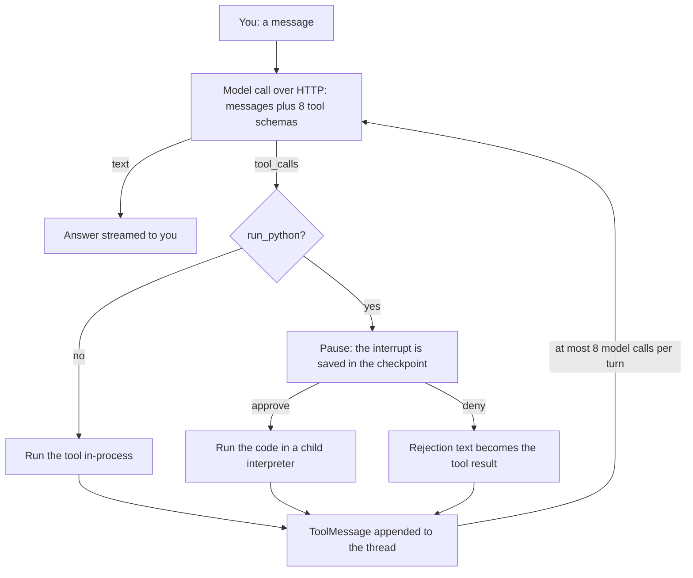
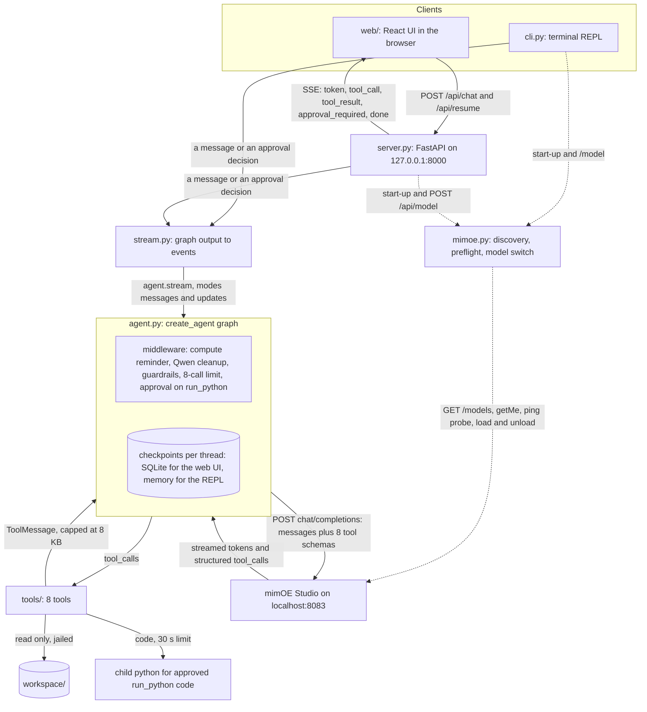
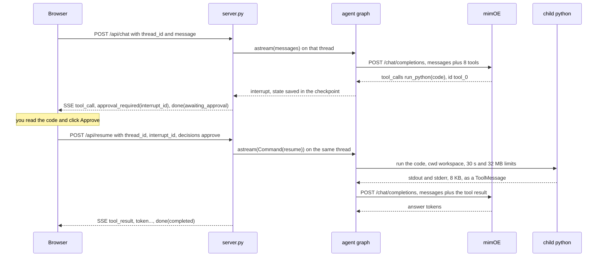

# Design

How mimoe-agent works and why it is built this way: [what happens in one turn](#approach), the
[frameworks and tools I chose](#framework-and-tooling-choices) and the alternatives I rejected, and
[how the modules, the HTTP API and the events fit together](#how-the-components-connect). To
install and run it, see the [README](../README.md).

## Approach

In plain English, one turn works like this:

1. Your message and the schemas of the eight tools go to the model in one `POST /chat/completions`
   to mimOE, with streaming on.
2. The model either answers in text or asks for a tool; mimOE turns the model's `<tool_call>` text
   into a structured `tool_calls` entry, so the agent sees a normal OpenAI-style function call.
3. The agent runs the tool in-process, except `run_python`, which first pauses the run and asks you
   to approve or deny the code it wants to execute.
4. The tool's result goes back to the model as a `tool` message and the loop repeats, at most
   8 model calls per turn.
5. Everything that happens (tokens, tool calls, tool results, the approval request, the final
   stats) is emitted as an event while it happens, and the terminal and the browser render the
   same event stream.

Before the first turn, a preflight discovers the engine (`GET /models`, JSON-RPC `getMe`), picks
the model, decides how to switch thinking off for that engine generation, and runs the warm-up
`ping` completion. A model that does not answer the ping with a structured tool call gets the agent
in chat-only mode (`--force-tools` overrides), so a reviewer who only loaded SmolLM2 still gets a
working, honest program.

Two lines of LangGraph vocabulary, since `create_agent` compiles to a LangGraph graph:

- **Thread** and **checkpoint**: a thread is one conversation, identified by a `thread_id`; after
  every step the graph saves its state (the messages so far and any pending interrupt) as a
  checkpoint, so a run can stop and continue later. The web server keeps checkpoints in SQLite
  (`AsyncSqliteSaver`), so conversations survive a restart; the REPL keeps them in memory.
- **Interrupt** and **resume**: `HumanInTheLoopMiddleware` raises an interrupt when the model calls
  `run_python`; the run ends with the state saved and the request reported to you; a later
  `Command(resume={"decisions": [...]})` on the same thread continues the graph from exactly that
  point, running or rejecting the call. In the web UI those are two separate HTTP requests.

## Framework and tooling choices

| Choice | Why | The alternative I rejected, and why |
|---|---|---|
| LangChain `create_agent` (LangChain 1.4 on LangGraph 1.2) | The loop, tool schemas, message bookkeeping, threads and the interrupt/resume mechanism are built in and tested; my code is the prompt, the tools, two small middleware classes and the wiring. | A raw OpenAI-SDK loop: about the same size for the happy path, but the approval pause across HTTP requests, per-thread state and tool error handling would all be hand-written and untested. "Simplest path" to me means the fewest things I have to get right myself. |
| `ChatOpenAI` from langchain-openai, plus a handful of mimOE adjustments: chat completions pinned (`use_responses_api=False`), the token cap sent as `max_tokens` in `extra_body` (ChatOpenAI renames it to `max_completion_tokens`, which mimOE ignores), `timeout=200` and `max_retries=0` (above the engine's 180 s limit; never replay a timed-out inference), `httpx` clients with `trust_env=False` (a proxy variable must not capture localhost), and a small subclass that keeps the `reasoning_content` field 1.0 engines send. | The endpoint is OpenAI-compatible except for exactly these quirks, and each one is a one-line fix in the constructor. | A custom `httpx` client: I would have re-implemented streaming, tool-call delta assembly and the error classes, for no gain. |
| Built-in `HumanInTheLoopMiddleware` on `run_python` | The pause survives across requests through the checkpoint, behaves identically in the CLI and the web UI, and the library validates the decision shape. | A prompt-only rule ("ask before running code"): a 4B model forgets instructions, and a safety boundary has to live in code, not in the prompt. |
| FastAPI + Server-Sent Events (`sse-starlette`) | Two POSTs (`/api/chat`, `/api/resume`) that stream events; plain HTTP you can `curl -N`; nothing to keep alive between requests. | WebSockets: bidirectional, but nothing here needs the client to talk mid-stream, and an approval is naturally a second request. SSE is easier to test and debug. |
| React + Vite + TypeScript, styled with Tailwind CSS and shadcn/ui-style components (Radix for the menus, lucide icons), with the built bundle committed in `web/dist` | The reviewer needs no Node.js; the components are copied in rather than a UI framework, nothing loads from the internet (system fonts, no CDN), and the reducer, SSE parser, stream consumer, tool steps, sidebar grouping and Markdown safety have vitest tests. | Streamlit or Gradio: the per-turn tool steps, the approval panel with one decision per request, Stop and resume did not fit their request/rerun model. LangChain's agent-chat-ui: polished, but it talks only to a LangGraph Server, whose default accepts requests from any website (it could start a run and approve its own code), needs Node to run, and renders images from model output. |
| uv | One command installs Python 3.13 and the locked dependencies on macOS, Windows and Linux; `uv run mimoe-agent` is the whole quickstart. | pip or poetry: pip needs a Python 3.13 and a venv first; poetry is one more tool to install. |
| Plain `@tool` functions, with pandas available to `run_python` | Eight ordinary functions whose docstrings are the descriptions the model reads; pandas because the model reaches for it every time and gets CSVs right (my csv-module fallback miscounted the header row). | RAG, a vector store or SQLite: the workspace is small, `read_file`/`search_files`/`run_python` answer everything, and an index is more setup, more dependencies and one more thing that can be stale. |
| An in-process fake engine for tests (`httpx.MockTransport` injected into ChatOpenAI and the engine client) | It reproduces the quirks of both engine generations (inline `<think>`, `reasoning_content`, `tool_0` ids, the error bodies, the model store), so 748 tests run on CI without Studio; nine live tests sit behind `MIMOE_LIVE=1`. | Recorded cassettes (VCR-style): brittle against streaming chunk boundaries, awkward to script a tool call followed by an answer, and tied to one engine version. |
| Python 3.13 as the floor | The workspace jail uses `ntpath.isreserved` (new in 3.13) and `Path.is_junction` (3.12) for Windows; uv installs 3.13 anyway. | Supporting 3.10 to 3.12 with fallbacks: more code paths to test on Windows for no benefit to the reviewer. |

## How the components connect

What each module does, in reading order:

- `config.py`: settings from flags, `MIMOE_*` variables, `./.env` and defaults, with the source of
  every value (the banner prints it).
- `mimoe.py`: the engine client. Finds the base URL and the engine generation, lists loaded and
  registered models, loads and unloads on both API shapes, runs the warm-up `ping` probe, and turns
  every failure into a message plus a Studio click path (`friendly_error`).
- `llm.py`: the `ChatOpenAI` factory pinned for mimOE (see the choices table).
- `agent.py`: the system prompt and `build_agent`, which is one `create_agent(...)` call with five
  middleware in this order: `ComputeReminderMiddleware` (adds "(Use calculator or run_python for any
  arithmetic.)" after a question that contains a number, in the request only; a small model answered
  small sums from memory despite the system prompt's rule), `QwenMiddleware` (moves inline `<think>`
  text out of the answer, appends
  `/no_think` on 0.6 engines, neutralises a malformed tool call), `GuardrailMiddleware` (caps every
  tool result at 8 KB, turns a tool exception into an error message the model can read, marks a
  result that reports a failure, such as `ERROR: ...` or a snippet that exited non-zero, as failed
  so both interfaces can say so in one line while the model reads the error, shortens tool results
  from earlier turns to 400 characters in the request only, resets the per-turn budget),
  `ModelCallLimitMiddleware(thread_limit=8)`, and `HumanInTheLoopMiddleware` on `run_python`
  (omitted with `--auto-approve`).
- `stream.py`: drives `agent.stream(..., stream_mode=["messages", "updates"])` and maps what
  LangGraph yields to neutral event dicts. Both clients use it, so the CLI and the web UI cannot
  drift apart. It also splits thinking from answer text in both transports (inline tags on 0.6,
  `reasoning_content` on 1.0) and makes tool-call ids unique (mimOE numbers every reply from
  `tool_0`).
- `tools/`: `workspace.py` (the path jail and `list_files`, `read_file`, `search_files`),
  `run_python.py` with `_runner.py` (the child interpreter), `system.py` (`calculator`, `now`,
  `git`, `mimoe_status`).
- `models.py`: the six model presets with their measured notes, `pull` through the registry of
  either generation, and `switch_model`.
- `cli.py`: the REPL, `serve`, and the `models` subcommands. Each turn runs on a worker thread
  while the REPL thread renders its events, because LangGraph runs graph nodes on pool threads
  and Python delivers Ctrl-C only to the main thread; Ctrl-C sets the turn's cancel signal.
- `server.py`: the HTTP API below, one `asyncio.Lock` per thread, lazy start (the server comes up
  even when Studio is down and reports the hint in `/api/health`), and the static bundle (the page
  is revalidated on every load, so a new build shows at once; the hashed scripts are cached).
- `history.py`: the conversation history. One SQLite file holds LangGraph's checkpoints and a small
  table of titles and times for the sidebar; `transcript()` turns a reopened thread's messages
  back into the turns the UI drew while they streamed (tool-call ids and a pending approval
  included, so a resume after a restart lands on the right call).
- `web/src`: `events.ts` (the wire types), `sse.ts` (parser), `api.ts`, `reducer.ts` (events to
  ordered blocks per assistant turn), `useChat.ts` and `useThreads.ts`, `threads.ts` (sidebar
  grouping), and the components (`Sidebar`, `TopBar`, `ModelMenu`, `Transcript`, `ToolCard`,
  `ApprovalPanel`, `Composer`).

The HTTP API and the events (the full contract is in `docs/CONTRACTS.md`):

| Route | Body | Result |
|---|---|---|
| `POST /api/chat` | `{thread_id, message}` | SSE stream; 409 while a run is in progress or an approval is pending on that thread |
| `POST /api/resume` | `{thread_id, interrupt_id, decisions: ["approve" or "reject", ...]}` | SSE stream; 409 if nothing is pending or the id is stale, 422 if the decisions do not fit |
| `GET /api/health` | | model, tokens/s, context, engine version and generation, workspace, mode `tools` or `chat_only`, and the error hint when Studio is not usable |
| `GET /api/models`, `POST /api/model` | `{model, unload_previous}` | list loaded and registered models; switch, re-probe and rebuild the agent |
| `GET /api/threads` | | the saved conversations, most recently used first: `{id, title, created_at, updated_at}` |
| `GET /api/threads/{id}` | | one conversation's turns as the UI draws them, and its pending approval, if any |
| `PATCH /api/threads/{id}`, `DELETE /api/threads/{id}` | `{title}` | rename; delete the conversation and its checkpoints (409 while it runs) |
| `GET /` | | the committed `web/dist` |

| Event | Payload | When |
|---|---|---|
| `token`, `thinking` | `{text}` | answer text, reasoning text (shown collapsed) |
| `tool_call` | `{id, name, args}` | the model asked for a tool |
| `tool_result` | `{id, name, content, is_error}` | the tool answered, or the rejection; `is_error` when it failed |
| `approval_required` | `{interrupt_id, action_requests, review_configs}` | `run_python` is waiting for you; followed by `done` |
| `notice` | `{text}` | the model-call limit ended the turn |
| `done` | `{status: completed or awaiting_approval, elapsed_s, model, usage_total}` | end of the run |
| `error` | `{message, hint}` | failure, no `done` follows |

One approved `run_python` in the web UI, across two HTTP requests:

What happens on Deny: the resume carries `{"type": "reject", "message": "The user declined to run
this code. Tell the user it was not executed and stop; do not retry."}`. The middleware writes that
sentence as an error `ToolMessage` in place of a result (no code runs), the model reads it and
answers along the lines of "The code was not executed as the user declined to run it", the CLI
prints "not executed; the model is told the code did not run", and the web card turns to `denied`.
A bare reject without the message produced a confused answer, hence the wording. In the CLI, EOF,
Ctrl-C at the question and anything other than `y`/`yes` count as a denial. The server validates a
resume before it touches the graph (right thread, right `interrupt_id`, one allowed decision per
request), because a malformed resume would poison the thread.
